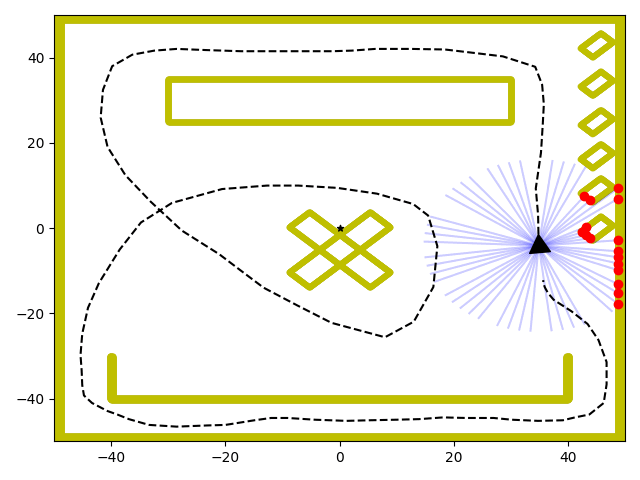

# VSA-OGM - Occupancy Grid Mapping in 2D

In this application of bio-inspired vector symbolic architectures, we employ a novel hyperdimensional occupancy grid mapping system with Shannon entropy. For the most in-depth exploration of our experiments and results, please take a look at [our paper](https://arxiv.org/pdf/2408.09066).

*This work was supported under grant 5.21 from the University of Michigan's Automotive Research Center (ARC) and the U.S. Army's Ground Vehicle Systems Center (GVSC).* 

 

## Installation

VSA-OGM is packaged as a Python package. You can install it locally with:

```bash
python -m pip install .
```

It has currently been tested on MacOS and Ubuntu with CPU and CUDA 11.7. Other operating systems and CUDA versions should be supported but it has not been formally tested.

## Usage

### Basic Usage

```python
from vsa_ogm import pointcloud_to_ogm

# Convert a point cloud to an occupancy grid map
pointcloud_to_ogm(
    input_file="inputs/obstacle_map.npy",
    output_file="outputs/obstacle_grid.npz",
    world_bounds=[-50, 50, -50, 50],  # Optional
    resolution=0.1,                   # Optional
    verbose=True                      # Optional
)
```

### Command Line Interface

VSA-OGM also provides a command-line interface:

```bash
# After installing the package
vsa-ogm inputs/obstacle_map.npy outputs/obstacle_grid.npz --verbose
```

Or you can run the module directly:

```bash
python -m vsa_ogm.main inputs/obstacle_map.npy outputs/obstacle_grid.npz --verbose
```

### Examples

Check out the `examples` directory for more usage examples:

```bash
python examples/basic_usage.py
```

## Directory Structure

- **src**: Core package with the VSA-OGM implementation
  - **main.py**: Main entry point with function-based API
  - **mapper.py**: Core VSA-OGM algorithm implementation
  - **functional.py**: Vector operations for VSA-OGM
  - **io.py**: Input/output functions
  - **utils.py**: Utility functions
- **examples**: Example scripts demonstrating usage
- **tests**: Unit tests
- **docs**: Documentation and refactoring plans

## Datasets

For information about the datasets used in the original experiments, please refer to [our paper](https://arxiv.org/pdf/2408.09066).

## Authors and Contact Information

- **Shay Snyder****: [ssnyde9@gmu.edu](ssnyde9@gmu.edu)
- **Andrew Capodieci**: [acapodieci@neyarobotics.com](acapodieci@neyarobotics.com)
- **David Gorsich**: [david.j.gorsich.civ@army.mil](david.j.gorsich.civ@army.mil)
- **Maryam Parsa**: [mparsa@gmu.edu](mparsa@gmu.edu)

If you have any issues, questions, comments, or concerns about VSA-OGM, please reach out to the corresponding author (**). We will respond as soon as possible.

## Reference and Citation

If you find our work useful in your research endeavors, we would appreciate if you would consider citing [our paper](https://arxiv.org/pdf/2408.09066):

```text
@misc{snyder2024braininspiredprobabilisticoccupancy,
      title={Brain Inspired Probabilistic Occupancy Grid Mapping with Hyperdimensional Computing}, 
      author={Shay Snyder and Andrew Capodieci and David Gorsich and Maryam Parsa},
      year={2024},
      eprint={2408.09066},
      archivePrefix={arXiv},
      primaryClass={cs.RO},
      url={https://arxiv.org/abs/2408.09066}, 
}
```
